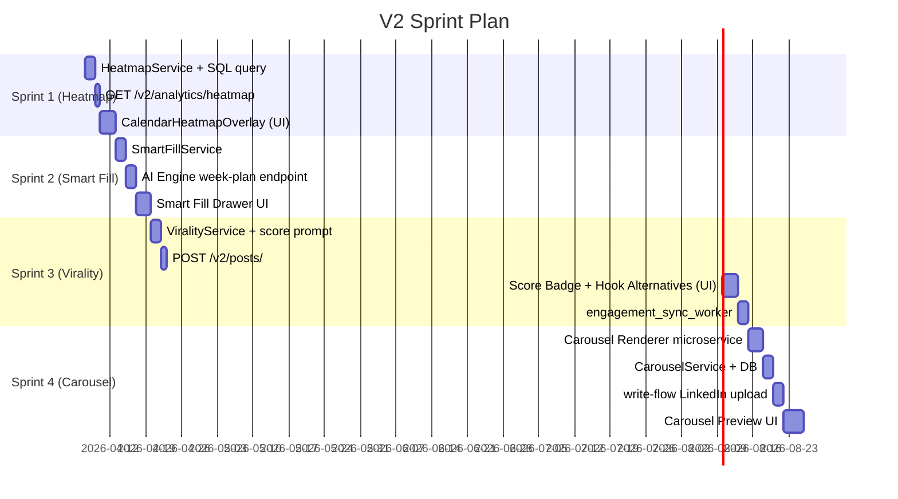

# LinkedIn-as-a-Service V2 — Technical Architecture

## Scope
Four features across two surfaces (Posts + Calendar), all versioned under `/api/v2/`:

1. **Carousel Studio** — AI-generated swipeable PDF posts
2. **Virality Scoring Engine** — Pre-post AI prediction + data flywheel
3. **Posting Time Heatmap** — Smart time recommendations from real engagement data
4. **Smart Fill Calendar** — AI auto-populates a full week from user-defined pillars

---

## Overall V2 Principles

- **Versioned APIs:** All new endpoints live at `/api/v2/` — `v1` remains unchanged
- **Feature-flagged:** Each V2 capability gated by a `feature_flags` config in `config.yaml`
- **No regressions:** V1 models and routes untouched; V2 extends via new schemas and services
- **Write-flow integration:** Publishing now routes through `linkedin-write-flow-poc` OAuth client

---

## Feature 1: Carousel Studio

### How It Works
User selects an idea → clicks "Make Carousel" → AI generates a 7-slide outline → backend renders a branded PDF → user previews in-browser → one-click publish via write-flow.

### Backend (`core_api`)

**New endpoint:**
```
POST /api/v2/posts/{post_id}/carousel
```

**New DB Model — `CarouselAsset`** (`apps/core_api/app/models/carousel.py`)
```python
class CarouselAsset(BaseModel):
    id: UUID
    post_id: UUID                  # FK → posts
    slides_json: dict              # Raw AI-generated outline
    pdf_url: str                   # GCS/S3 URL of rendered PDF
    slide_count: int
    status: str                    # draft | rendered | published
    linkedin_asset_urn: str | None # Returned after LinkedIn upload
    created_at: datetime
```

**New Service — `CarouselService`** (`apps/core_api/app/services/carousel_service.py`)
```
1. Call AI Engine → POST /v2/generate/carousel-outline
2. Receive 7-slide JSON structure
3. Call Carousel Renderer (Puppeteer microservice or WeasyPrint)
4. Upload PDF to GCS → get signed URL
5. Persist CarouselAsset to Postgres
6. On publish: call write-flow to Register Upload → Upload PDF → Create Post
```

### AI Engine Extension

**New endpoint:**
```
POST /webhooks/v2/generate/carousel-outline
```

**Prompt strategy:**
```
System: You are a LinkedIn carousel expert. Generate a 7-slide outline.
        Slide 1: Provocative hook (curiosity gap or contrarian take)
        Slides 2-6: One actionable insight per slide, max 40 words
        Slide 7: CTA + teaser for next post
        Return: JSON array of {slide_number, headline, body, visual_suggestion}

User: Topic: {topic}, Audience: {audience}, Tone: {tone}
```

### New Microservice: Carousel Renderer

- **Tech:** Node.js + Puppeteer or Python + WeasyPrint
- **Input:** POST `{slides_json, brand_kit}`
- **Output:** Returns PDF binary → stored in GCS
- **Brand kit:** logo, primary color, font — stored per-user in `user_settings` table

### Frontend (`/posts` + `/posts/[id]/carousel`)

```
[ Idea Card ]
    └── [✨ Make Carousel] button
          → Opens Carousel Preview Panel
               ├── 7 slide thumbnails (swipeable)
               ├── Editable headline/body per slide
               ├── [🔄 Regenerate Slide] per card
               └── [🚀 Publish as Carousel] → write-flow OAuth
```

### LinkedIn Write-Flow Integration

LinkedIn's 3-step Document Upload API:
1. `POST /rest/documents?action=initializeUpload` → get `uploadUrl` + `document URN`
2. `PUT {uploadUrl}` with PDF binary
3. `POST /rest/posts` with `{"content": {"media": {"id": "urn:li:document:..."}}, ...}`

---

## Feature 2: Virality Scoring Engine

### How It Works
Before posting, every draft receives a 1–100 virality score + 3 alternative hooks. After posting, real engagement metrics feed back to refine future scoring.

### Backend (`core_api`)

**New endpoint:**
```
POST /api/v2/posts/{post_id}/score
GET  /api/v2/posts/{post_id}/score      # Returns cached score
```

**Extend existing [Post](file:///Users/cortex/ventures/linkedin-as-a-service/apps/core_api/app/workers/ingestion_worker.py#40-50) model** — add columns:
```python
virality_score: int | None             # 0-100
hook_alternatives: list[dict] | None   # [{hook, predicted_score}]
actual_engagement_rate: float | None   # Calculated after publish
score_updated_at: datetime | None
```

**New Service — `ViralityService`** (`apps/core_api/app/services/virality_service.py`)
```
1. Fetch user's top 20 performing posts by engagement_rate from Postgres
2. Send current draft + top performers to AI Engine
3. Receive score + 3 hook alternatives
4. Persist to post record
5. After post publishes: scheduler polls LinkedIn API for metrics
6. Calculates actual_engagement_rate = (likes + comments * 3 + shares * 5) / impressions
7. Updates post record + feeds DPO training queue
```

**Background Worker — `engagement_sync_worker.py`**
- Runs every 6 hours
- Queries published posts < 7 days old
- Pulls live stats from LinkedIn via oauth token
- Updates `likes`, `comments_count`, `impressions` on the [Post](file:///Users/cortex/ventures/linkedin-as-a-service/apps/core_api/app/workers/ingestion_worker.py#40-50) model
- Triggers virality score recalibration for that user

### AI Engine Extension

**New endpoint:**
```
POST /webhooks/v2/score/post
```

**Prompt strategy:**
```
System: You are a LinkedIn algorithm expert. Given the user's top performing posts
        as training data, score this draft on:
        - Hook strength (0-30): Does it create curiosity or challenge assumptions?
        - Readability (0-20): Short paragraphs, line breaks, mobile-friendly?
        - Value density (0-30): Clear insight per line?
        - CTA quality (0-20): Does it invite genuine conversation?
        Return: {total_score: int, breakdown: {...}, hooks: [3 alternatives with predicted scores]}

User: Draft: {post_text}
      Top performers: {top_posts_sample}
```

### Frontend (`/posts/[id]`)

```
[ Post Editor ]
    ├── Virality Score Badge — [ ⚡ 74/100 ] → click to expand breakdown
    │       ├── Hook Strength: 22/30
    │       ├── Readability:   18/20
    │       ├── Value:         24/30
    │       └── CTA:           10/20  ← red = needs work
    │
    └── Alternative Hooks Panel
            ├── "AI Automation: The Great Equalizer...?"  [87/100] [Use This]
            ├── "I Almost Lost My Startup to AI..."       [79/100] [Use This]
            └── "The Dirty Little Secret of AI..."        [82/100] [Use This]
```

### DPO Data Flywheel

After 30+ days of real posting:
```
Published Post → Engagement Sync → actual_engagement_rate
     ↓
Compare predicted score vs actual engagement
     ↓
Feed delta into LLM training dataset (preference pairs)
     ↓
Fine-tune scoring prompt OR update few-shot examples
     ↓
Better predictions → more viral posts → more data
```

---

## Feature 3: Posting Time Heatmap

### How It Works
The calendar grid overlays a colour-coded engagement heatmap based on historical post performance, derived from the existing ingestion pipeline.

### Backend (`core_api`)

**New endpoint:**
```
GET /api/v2/analytics/heatmap?user_id={id}&weeks=8
```

**Response:**
```json
{
  "heatmap": {
    "monday": {
      "06": 0.12, "07": 0.18, "08": 0.34, "09": 0.72,
      "10": 0.91, "11": 0.88, "12": 0.65, ...
    },
    "tuesday": { "09": 0.94, "10": 0.98, ... },
    ...
  },
  "best_slots": [
    {"day": "tuesday",  "hour": 10, "avg_engagement_rate": 0.98},
    {"day": "thursday", "hour": 09, "avg_engagement_rate": 0.94}
  ],
  "worst_slots": [
    {"day": "saturday", "hour": 21, "avg_engagement_rate": 0.08}
  ]
}
```

**New Service — `HeatmapService`** (`apps/core_api/app/services/heatmap_service.py`)
```sql
SELECT
    EXTRACT(DOW FROM published_at) AS day_of_week,
    EXTRACT(HOUR FROM published_at) AS hour,
    AVG((likes + comments_count * 3) / NULLIF(impressions, 0)) AS engagement_rate
FROM posts
WHERE user_id = :user_id
  AND published_at IS NOT NULL
  AND impressions > 0
  AND published_at > NOW() - INTERVAL '8 weeks'
GROUP BY day_of_week, hour
ORDER BY engagement_rate DESC
```

> **Note:** Works from Day 1 using global LinkedIn benchmarks (Tue/Thu 9–11am) as seed data; personalizes once user has ≥5 published posts with impression data.

### Frontend (`/calendar`)

```
Calendar Grid (week view)
    ├── Each hour cell has background color:
    │       green (#00c47f at 90%+ opacity)  = high engagement
    │       yellow = medium
    │       red = low
    │       grey = no data yet
    │
    ├── Hover tooltip on any cell:
    │       "Tuesday 10am — Avg 4.2% engagement rate (6 posts)"
    │
    └── When dragging post to a red slot:
            ⚠️  Toast warning: "Low engagement zone. Best slot nearby: Tue 10am"
                [ Keep Here ] [ Move to Best Slot ]
```

**Component:** `CalendarHeatmapOverlay.tsx`
- Fetches `/api/v2/analytics/heatmap` once on page load
- Injects CSS custom property `--slot-heat: 0.87` per cell
- Uses `background: rgba(0, 196, 127, var(--slot-heat))`

---

## Feature 4: Smart Fill Calendar

### How It Works
User defines 3 content pillars + weekly frequency → clicks "AI Fill My Week" → AI slots a full 7-day schedule with best posting times → user drags to adjust → saves as drafts.

### Backend (`core_api`)

**New endpoint:**
```
POST /api/v2/calendar/smart-fill
Body: {
  user_id: UUID,
  week_start: date,           # ISO 8601
  pillars: [str, str, str],   # ["AI Automation", "Founder Stories", "Product Tips"]
  posts_per_week: int,        # 3-5
  preferred_formats: [str]    # ["text", "carousel", "video"]
}
```

**Response:** Array of draft post objects with `scheduled_at` pre-set to optimal heatmap slots.

**Flow in `SmartFillService`:**
```
1. Call HeatmapService → get best N available slots for the week
2. Call AI Engine → POST /webhooks/v2/generate/week-plan
3. Receive N post drafts with pillar assignment, format, hook, and body
4. Create N Post records with status="draft" + scheduled_at=best_slot
5. Return all drafts for frontend preview
```

### AI Engine Extension

**New endpoint:**
```
POST /webhooks/v2/generate/week-plan
```

**Prompt strategy (with format routing):**
```
System: You are a LinkedIn content strategist. Generate a balanced weekly content plan.
        Alternate between the provided pillars and formats.
        Format mix rule: max 2 text posts, 1 carousel, 1 video hook per week.
        Each post must have: hook (first line), body (3-5 bullet points), CTA.
        Return: JSON array of {pillar, format, hook, body, cta, suggested_slide_count?}

User: Pillars: {pillars}
      Posts this week: {count}
      Preferred formats: {formats}
      User's top 3 past posts (for tone/voice calibration): {top_posts}
```

### Frontend (`/calendar`)

```
Calendar Header
    └── [🤖 AI Fill My Week] button (top right)
          → Opens "Smart Fill" Drawer
               ├── Pillar 1: [______________] (text input with autocomplete)
               ├── Pillar 2: [______________]
               ├── Pillar 3: [______________]
               ├── Posts/Week: [3] [4] [5]
               ├── Formats: [✓ Text] [✓ Carousel] [ ] Video
               └── [✨ Generate Plan]
                     → Calendar fills with draft cards
                     → Each card shows: pillar badge, format icon, hook preview
                     → "Accept All" or drag individual cards to adjust
```

---

## Shared Infrastructure Changes

### New DB Migrations Required
| Migration | Table | Change |
|---|---|---|
| `002_carousel_assets` | `carousel_assets` | New table |
| `003_post_virality` | [posts](file:///Users/cortex/ventures/linkedin-as-a-service/apps/core_api/app/services/post_service.py#119-128) | Add `virality_score`, `hook_alternatives`, `actual_engagement_rate` |
| `004_user_settings` | `user_settings` | New table: brand kit, pillars, posting frequency |

### New ENV Variables
```bash
# Write Flow OAuth
LINKEDIN_WRITE_CLIENT_ID=...
LINKEDIN_WRITE_CLIENT_SECRET=...
LINKEDIN_WRITE_REDIRECT_URI=http://localhost:8000/api/v2/auth/linkedin/callback

# Carousel Renderer (new microservice)
CAROUSEL_RENDERER_URL=http://localhost:8002

# GCS (for PDF storage)
GCS_BUCKET_NAME=linkedin-as-a-service-assets
```

### API Version Router ([core_api/app/main.py](file:///Users/cortex/ventures/linkedin-as-a-service/apps/core_api/app/main.py))
```python
from app.controllers.v2 import carousel, virality, heatmap, smart_fill

app.include_router(carousel.router,   prefix="/api/v2/posts",     tags=["v2-carousel"])
app.include_router(virality.router,   prefix="/api/v2/posts",     tags=["v2-virality"])
app.include_router(heatmap.router,    prefix="/api/v2/analytics", tags=["v2-heatmap"])
app.include_router(smart_fill.router, prefix="/api/v2/calendar",  tags=["v2-calendar"])
```

---

## Implementation Sequence (Recommended)



> **Start with Heatmap** (Sprint 1) — it's pure read-path, requires no new microservices, and delivers an immediate "wow moment" using data that already exists in your Postgres instance.
